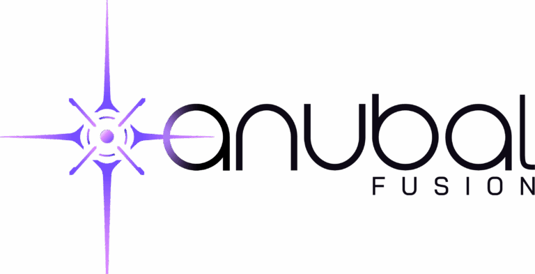

### Tags
#fusion 
### Name
Anubal Fusion
### Logo

### Overview
Inertial Confinement Fusion. Fuel: Hydrogen Boron. Driver: Petawatt laser using Plasma optics.
### Location
Hyderabad, India
### Contact details
pravin.kini@anubalfusion.com
### Website
https://anubalfusion.com/
### Year founded
2024
### Primary target markets
Electricity generation
### Total declared funding to date
$500,000
### Employees
10
### Approach
Inertial confinement
### Fuel source
pB11
### Energy capture
Direct energy conversion
### Pilot plant timescale
2030
### Anticipated MWe of commercial operating facility
200 MWe
